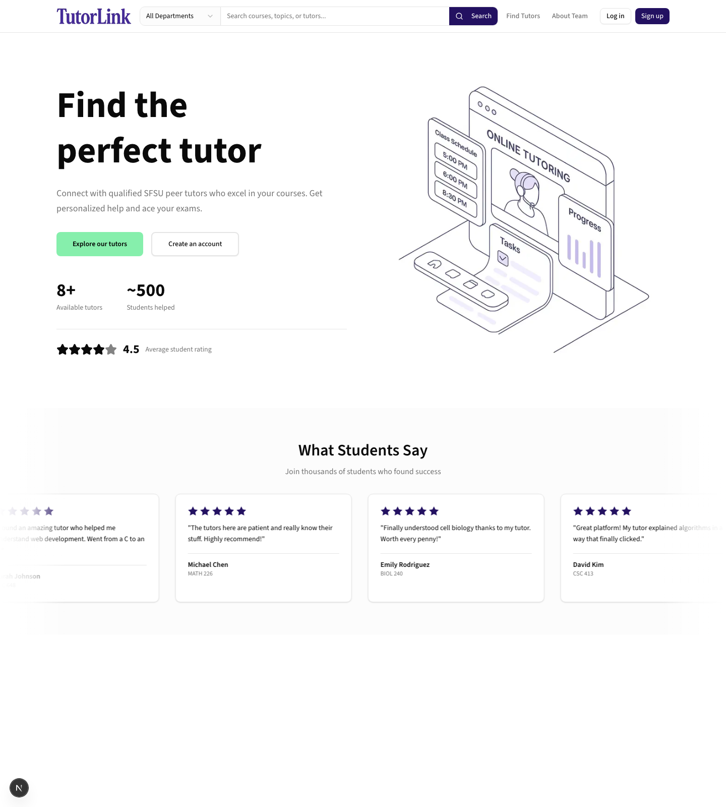

# TutorLink

> A peer-to-peer tutoring marketplace for university students — find a tutor for a specific course, post your own tutoring services, and connect directly with classmates.

TutorLink lets students search for tutors by course, browse tutor profiles (GPA, major, year, availability), and send tutoring requests. Tutors can create listings for the courses they're qualified to teach. Built as a full-stack web application using a **Backend-for-Frontend (BFF)** architecture.



---

## Features

- **Course-based tutor search** — filter tutor listings by course code or tutor name
- **Tutor listings** — tutors post their course, GPA, major, year, availability, bio, and profile photo
- **Tutoring requests** — students send a request with a message and contact info to a specific tutor
- **Authentication** — register / login with bcrypt-hashed passwords and `@sfsu.edu` email validation
- **Member & tutor profile pages** — dynamic routes for individual tutors and team members
- **Health check endpoint** — verifies API and database connectivity

## Tech Stack

| Layer        | Technologies                                                        |
| ------------ | ------------------------------------------------------------------- |
| **Frontend** | Next.js 15, React 19, Tailwind CSS 4, Radix UI, lucide-react        |
| **Backend**  | Node.js, Express 4, Knex query builder                              |
| **Database** | MySQL 8                                                             |
| **Auth**     | bcryptjs password hashing                                           |
| **Hosting**  | AWS EC2 (Node + MySQL), PM2 process manager                        |

## Architecture

TutorLink uses the **Backend-for-Frontend (BFF)** pattern:

```
Browser  ─►  Next.js UI  ─►  Next.js API routes (BFF proxy)  ─►  Express API  ─►  MySQL
             (React)         /frontend/src/app/api/*             /backend         (Knex)
```

- **Frontend (Next.js)** renders the UI and exposes API routes that proxy to the backend.
- **Backend (Express)** owns all business logic and database access — DB credentials never reach the browser.
- **Database (MySQL)** is managed with Knex migrations and seed data for a reproducible schema.

This keeps concerns separated, keeps secrets server-side, and lets the frontend and backend scale and deploy independently.

## Getting Started

### Prerequisites

- Node.js 18+
- MySQL 8+

### Quick start (one command)

With MySQL installed and the two env files in place (see below), start the whole stack from the project root:

```bash
./start.sh
```

This launches MySQL, the backend API (`:3001`), and the frontend (`:3000`), and stops all three with `Ctrl-C`. For the manual, step-by-step setup, follow the sections below.

### 1. Backend

```bash
cd application/backend
npm install

# Configure your database connection
cp .env.example .env        # then edit with your DB credentials

npm run db:setup            # runs migrations + seeds
npm run dev                 # starts API on http://localhost:3001
```

**`.env`**

```bash
PORT=3001
DB_HOST=localhost
DB_PORT=3306
DB_USER=your_db_user
DB_PASS=your_db_password
DB_NAME=tutoring_db
FRONTEND_URL=http://localhost:3000
NODE_ENV=development
```

### 2. Frontend

```bash
cd application/frontend
npm install
echo "BACKEND_URL=http://localhost:3001" > .env.local
npm run dev                 # starts UI on http://localhost:3000
```

Open **http://localhost:3000**.

## API Overview

All endpoints are reachable through the Next.js BFF layer at `/api/*`.

| Method | Endpoint             | Description                                       |
| ------ | -------------------- | ------------------------------------------------- |
| `GET`  | `/api/health`        | API + database connectivity check                 |
| `POST` | `/api/auth/register` | Register a new user (`@sfsu.edu` required)         |
| `POST` | `/api/auth/login`    | Authenticate an existing user                      |
| `GET`  | `/api/courses`       | Search courses by code, department, or name        |
| `GET`  | `/api/tutor-posts`   | List tutor posts, filterable by course and name    |
| `POST` | `/api/requests`      | Create a tutoring request                          |

See [`application/README.md`](application/README.md) for detailed request/response schemas and deployment notes.

## Project Structure

```
application/
├── frontend/          # Next.js app (UI + BFF API routes)
│   └── src/
│       ├── app/       # Pages and API proxy routes
│       └── components/
└── backend/           # Express API server
    └── src/
        ├── routes/    # API route handlers
        └── db/        # Knex connection, migrations, seeds
```

## Team

Built by a five-person team for CSC 648 (Software Engineering) at San Francisco State University:

| Name             | GitHub                                            |
| ---------------- | ------------------------------------------------- |
| Nathan Johnson   | [@Natty-2027](https://github.com/Natty-2027)      |
| Kirill Pavlov    | [@kirillpav](https://github.com/kirillpav)        |
| Sintia Plasencia | [@SintiaPlasencia](https://github.com/SintiaPlasencia) |
| Joshua Juan      | [@jjuan-SFSU](https://github.com/jjuan-SFSU)      |
| Momina Rezai     | [@Mominarez](https://github.com/Mominarez)        |
